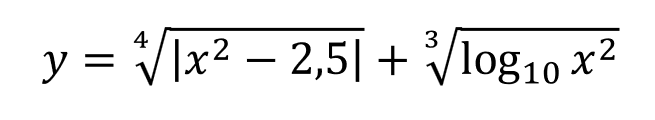
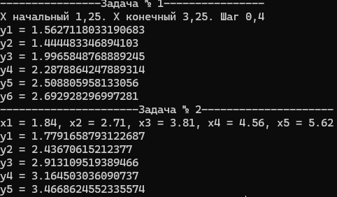

<h1 align="center">Задача по информатике Матэс Л.А.</h1>
<p align="center"></p>

<table align="center">
	<tbody>
		<tr>
			<td colspan="3" align="center">Задача № 1</td>
			<td colspan="5" align="center">Задача № 2</td>
		</tr>
		<tr>
			<td>Xн</td>
			<td>Xк</td>
			<td>XΔ</td>
			<td>X1</td>
			<td>X2</td>
			<td>X3</td>
			<td>X4</td>
			<td>X5</td>
		</tr>
		<tr>
			<td>1.25</td>
			<td>3.25</td>
			<td>0.4</td>
			<td>1.84</td>
			<td>2.71</td>
			<td>3.81</td>
			<td>4.56</td>
			<td>5.62</td>
		</tr>
	</tbody>
</table>

## Установка библиотеки для работы с массивами
```bash
pip install numpy
```

<h1 align="center">Ответ, выдаваемый в терминале</h1>
<p align="center"></p>